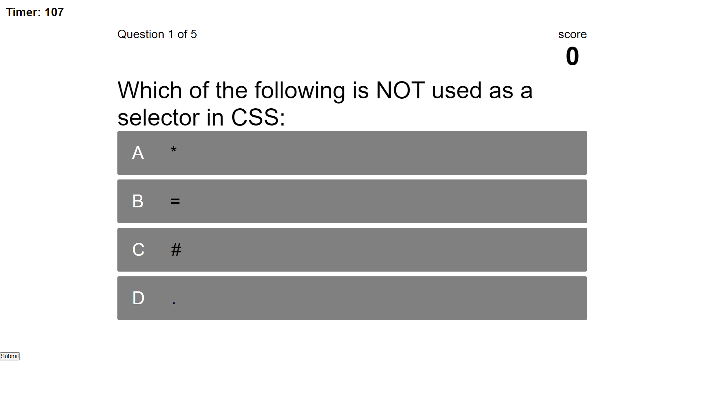

# Coding Quiz Challenge
This is a coding quiz challenge, built with HTML, CSS, & JavaScript. It contains: 
- a home page where the quiz rules are displayed and where the user may start the quiz
- a codequiz page where the questions and choices, question number, user score, and timer are displayed
- a highscores page where the user's final score and leaderboard are displayed

Application Screenshot:

Deployed application URL: https://walidhkhan.github.io/code-quiz/